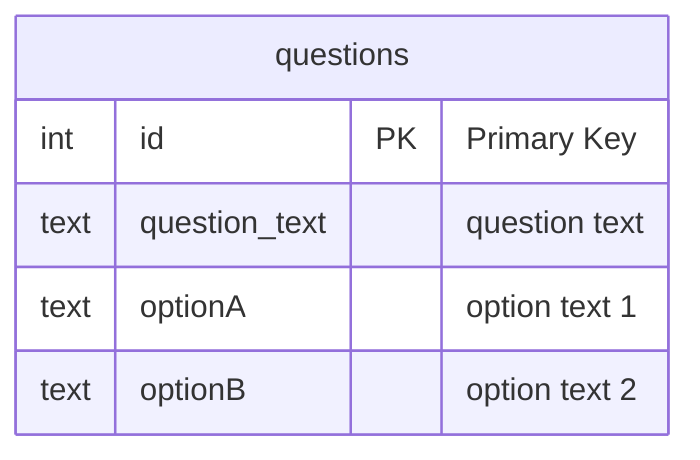

# データベース設計

## ER 図

```mermaid
erDiagram

    questions {
        int id PK "Primary Key"
        text question_text "question text"
        text optionA "option text 1"
        text optionB "option text 2"
    }

```

## 説明

質問文に対する選択肢は 1 対 2 が想定されるため、テーブルの分割はしない．
