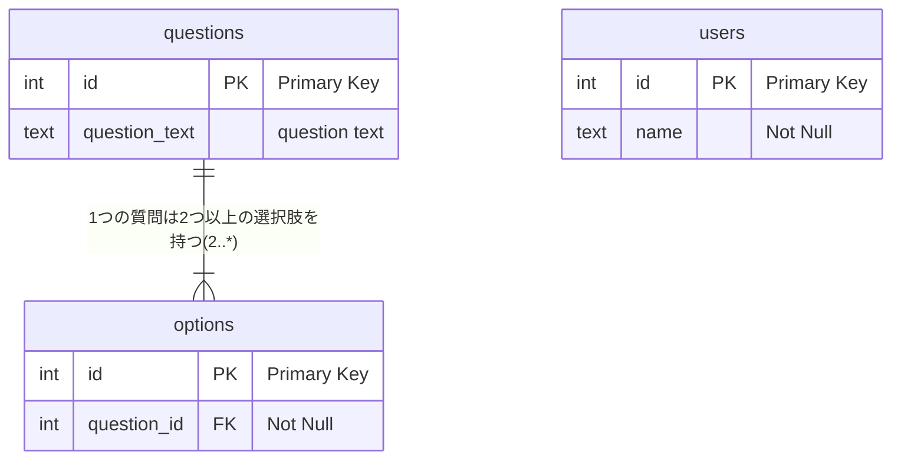

# データベース設計

## ER 図

```mermaid
erDiagram
    questions ||--|{ options : "1つの質問は2つ以上の選択肢を持つ(2..*)"

    users {
        int id PK "Primary Key"
        text name "Not Null"
    }

    questions {
        int id PK "Primary Key"
        text question_text "question text"
    }

    options {
        int id PK "Primary Key"
        int question_id FK "Not Null"

    }

```

## 説明

質問文に対する選択肢は 1 対 2 を基本として想定している。
左右それぞれに対応する選択肢が存在するはずだからである。
