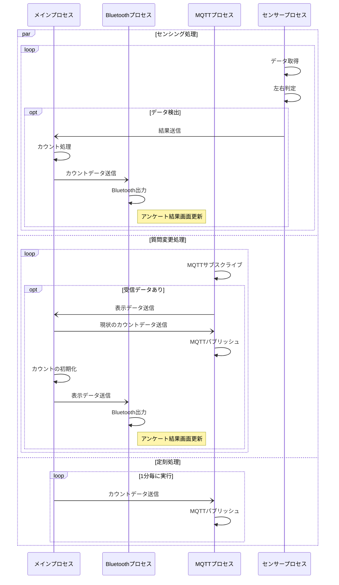

# Spresense 設計

```mermaid
sequenceDiagram
    participant Main as メインプロセス
    participant Bt as Bluetoothプロセス
    participant Mqtt as MQTTプロセス
    participant Sensor as センサープロセス

    par センシング処理
        loop
            Sensor ->> Sensor: データ取得
            Sensor ->> Sensor: 左右判定
            opt データ検出
                Sensor -) Main: 結果送信
                Main ->> Main: カウント処理
                Main -) Bt: カウントデータ送信
                Bt ->> Bt: Bluetooth出力
                Note right of Bt:アンケート結果画面更新
            end
        end

    and 質問変更処理
        loop
            Mqtt ->> Mqtt: MQTTサブスクライブ
            opt 受信データあり
                Mqtt -) Main: 表示データ送信
                Main -) Mqtt: 現状のカウントデータ送信
                Mqtt ->> Mqtt: MQTTパブリッシュ
                Main ->> Main: カウントの初期化
                Main -) Bt: 表示データ送信
                Bt ->> Bt: Bluetooth出力
                Note right of Bt:アンケート結果画面更新
            end
        end
    and  定刻処理
        loop 1分毎に実行
            Main -) Mqtt: カウントデータ送信
            Mqtt ->> Mqtt: MQTTパブリッシュ
        end

    end
```
