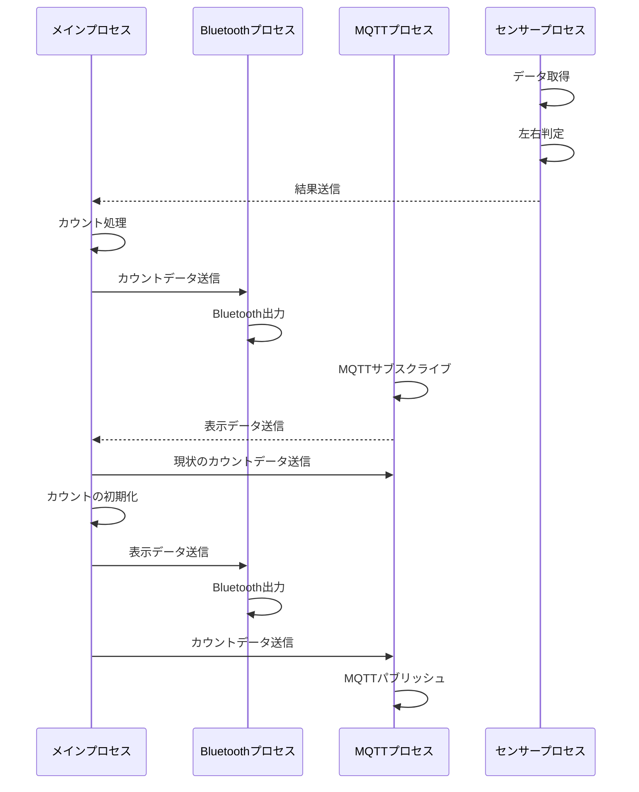

# Spresense 設計

```mermaid
sequenceDiagram
    participant Main as メインプロセス
    participant Bt as Bluetoothプロセス
    participant Mqtt as MQTTプロセス
    participant Sensor as センサープロセス
    Sensor ->> Sensor: データ取得
    Sensor ->> Sensor: 左右判定
    Sensor -->> Main: 結果送信
    Main ->> Main: カウント処理
    Main ->> Bt: カウントデータ送信
    Bt ->> Bt: Bluetooth出力
    Mqtt ->> Mqtt: MQTTサブスクライブ
    Mqtt -->> Main: 表示データ送信
    Main ->> Mqtt: 現状のカウントデータ送信
    Main ->> Main: カウントの初期化
    Main ->> Bt: 表示データ送信
    Bt ->> Bt: Bluetooth出力
    Main ->> Mqtt: カウントデータ送信
    Mqtt ->> Mqtt: MQTTパブリッシュ
```
